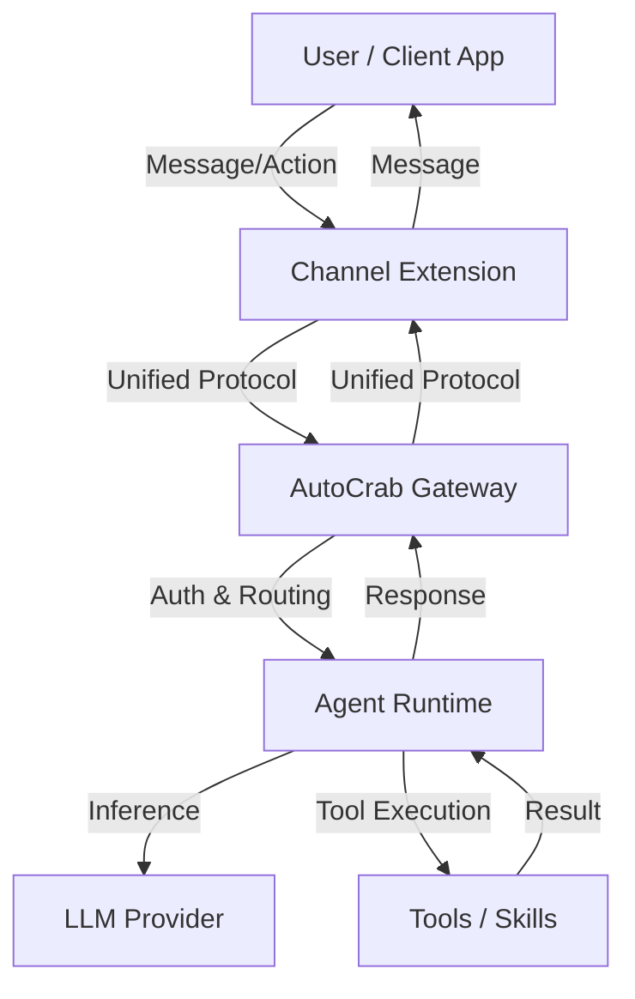

# AutoCrab Architecture

**Original Source:** Forked from OpenClaw 3.3.
**Maintainer:** Dr Leshi Chen <chenleshi@hotmail.com>
**License:** MIT (See [LICENSE](LICENSE))

---

## 1. System Overview

AutoCrab is a personal AI assistant platform designed for self-hosting, privacy, and extensibility. It acts as a central gateway between Large Language Models (LLMs) and your digital life (messaging channels, local devices, web services).

The system is built as a modular _Gateway_ that coordinates:

- **Channels**: Inbound/outbound messaging (Discord, Telegram, Slack, etc.).
- **Agents**: Intelligent workers powered by LLMs (OpenAI, Anthropic, Ollama).
- **Tools**: Capabilities exposed to agents (Web Search, File I/O, Python/Node execution).
- **Plugins**: Extensions that add new channels, memory providers, or tools.

### High-Level Data Flow



---

## 2. Core Components

### 2.1 The Gateway (`src/gateway`)

The kernel of AutoCrab, acting as the central request router and orchestrator. It differs significantly from the original OpenClaw implementation through extensive modularization and security hardening.

| Component                | Responsibility                                                                                                                                            |
| :----------------------- | :-------------------------------------------------------------------------------------------------------------------------------------------------------- |
| **`auth/`**              | **Authentication Mode Policy**: Enforces strict separation between auth methods (Token vs. Password vs. Trusted Proxy) to prevent bypass vulnerabilities. |
| **`server.ts`**          | **Lifecycle Management**: Main server initialization, WebSocket attachment, and shutdown handling.                                                        |
| **`server-chat.ts`**     | **Chat Orchestration**: Handles chat events and manages the registry of concurrent agent sessions.                                                        |
| **`server-methods.ts`**  | **RPC Methods**: Core handlers for channel operations, agent control, model management, and session access.                                               |
| **`server-channels.ts`** | **Channel Manager**: Coordinates messaging across all loaded extensions and routes messages to the appropriate agent.                                     |
| **`plugins/`**           | **Extension Loader**: Dynamically discovers, validates, and loads plugins from `extensions/` and user directories.                                        |
| **`http/`**              | **Networking**: HTTP/WebSocket server that routes requests to internal handlers or exposed extension endpoints.                                           |

### 2.2 Agent Runtime (`src/agents`)

Powers the intelligent task execution via a ReAct (Reasoning + Acting) loop.

- **`pi-embedded-runner/`**: The main execution engine (built on `@mariozechner/pi-agent-core`).
  - **Entry Point**: `run.ts` handles agent invocations.
  - **Execution Loop**: `run/attempt.ts` manages the single execution attempt with fallback logic.
  - **Payload Construction**: `run/payloads.ts` builds LLM request bodies.
- **`pi-embedded-subscribe.ts`**: Handles streaming responses, intercepts tool calls, executes them, and feeds results back into the ReAct loop.
- **`subagent-registry.ts`**: Manages the hierarchy of agents (parent/child), enabling recursive task breakdown with depth limits.
- **`auth-profiles/`**: Handles credential rotation and failover for model providers (e.g., swapping OpenAI keys or fallback to Anthropic).
- **`model-catalog.ts`**: Dynamic discovery of available models from configured providers.

### 2.3 Plugin System (`src/plugins`)

A capability-based extension system that loads features safely.

- **Discovery**: Scans `extensions/` (workspace packages), `~/.autocrab/extensions/`, and bundled plugins.
- **Loading**: Uses `jiti` for robust ESM + CommonJS interop.
- **Runtime API**: Plugins receive a `PluginRuntime` object that exposes controlled access to system services (Config, Media, TTS, STT, Tools, Logging) ensuring isolation.
- **Manifest**: Each plugin is defined by a `autocrab.plugin.json` validating its permissions and entry point.

### 2.4 Extensions (`extensions/`)

Independent workspace packages that implement specific capabilities.

- **Channels**: `@autocrab/discord`, `@autocrab/slack`, `@autocrab/telegram`, etc.
- **Features**: Memory providers (LanceDB), Auth providers, specific tool sets.
- **Structure**: Each extension is a full NPM package with its own `package.json` and build process, interacting with the core via `@autocrab/plugin-sdk`.

### 2.5 CLI (`src/cli`)

The primary management interface.

- **`onboard`**: Interactive wizard for simplified setup.
- **`configure`**: Manages persistent configuration with secure key storage.
- **`doctor`**: Diagnostic tool for environment health and legacy artifact detection.

### 2.6 Configuration (`src/config`)

Centralized configuration management.

- **Hierarchy**: Defaults → Environment Variables → `~/.autocrab/autocrab.json` → Runtime Overrides.
- **Validation**: Robust Zod-based schema validation ensuring type safety.
- **Hot Reload**: Supports dynamic reloading of configuration (channels, models) without restarting the gateway.

---

## 3. Data Flow: Life of a Message

```
User Message → Channel Extension → Gateway → Agent → LLM & Tools → Gateway → Channel → User
```

1.  **Inbound (User → Gateway)**:
    - A user sends a message on a channel (e.g., Discord).
    - The **Channel Extension** receives the webhook/socket event.
    - It normalizes the event into a standard `MessageEnvelope` and dispatches it to the Gateway.
    - **`server-channels.ts`** in the Gateway receives the envelope and routes it to the active agent session.

2.  **Agent Execution (Gateway → Agent → LLM)**:
    - **`server-chat.ts`** creates or retrieves a `ChatRunEntry`.
    - **`pi-embedded-runner`** restores the session transcript (from disk/memory).
    - It constructs a System Prompt containing capabilities, tools, and context.
    - The **ReAct Loop** begins: The agent sends the context to the LLM.

3.  **Tool Execution Loop**:
    - The LLM responds with text or a **Tool Call** (e.g., "Search Web", "Read File").
    - **`pi-embedded-subscribe.ts`** intercepts the tool call.
    - It validates permissions (Sandboxing, User Approval).
    - The tool is executed (Code execution happens in Docker/VM if configured).
    - The result is appended to the transcript, and the loop repeats.

4.  **Outbound (Agent → Channel → User)**:
    - The agent generates a final response (text + attachments).
    - **`server-chat.ts`** formats the response.
    - The **Channel Extension** translates the response to platform-specific API calls (e.g., Discord embeds, Slack blocks).
    - The user sees the response.

---

## 4. Key Concepts

### Session Management

- **Persistence**: Sessions are auto-saved to `~/.autocrab/sessions/<sessionKey>/*.jsonl`.
- **Compaction**: When context limits are reached, `pi-embedded-runner/compact.ts` summarizes older messages while preserving system prompts and recent context.

### Sandboxing & Security

- **Isolation**: Agents can run in Dockerized sandboxes to safely execute untrusted code.
- **Policies**:
  - **FileSystem**: `workspace-only`, `read-write` allowlists.
  - **Network**: SSRF protection, allowlists.
  - **Command Execution**: Approval flows for high-risk commands.

### Channel Plugin API

Extensions implement the `ChannelPlugin` interface, which defines capabilities:

```typescript
export interface ChannelPlugin<TAccount> {
  id: string;
  meta: ChannelMetadata;
  capabilities: ChannelCapabilities; // e.g., polls, threads, reactions

  // Adapters
  config: ChannelConfigAdapter<TAccount>;
  outbound?: ChannelOutboundAdapter; // Sending messages
  messaging?: ChannelMessagingAdapter; // Receiving messages
  agentTools?: ChannelAgentToolFactory; // Channel-specific tools
  // ... more adapters for pairing, onboarding, etc.
}
```

---

## 5. Directory Structure

The codebase is organized as a monorepo workspace.

```
/
├── apps/                   # Client applications (Mobile/Desktop)
│   ├── android/            # Android client
│   ├── ios/                # iOS client
│   └── macos/              # macOS client
├── extensions/             # Messaging channels & plugins (Workspace Packages)
│   ├── discord/            # @autocrab/discord
│   ├── slack/              # @autocrab/slack
│   ├── telegram/           # @autocrab/telegram
│   └── ...                 # Signal, WhatsApp, etc.
├── packages/               # Shared libraries & specific bot implementations
├── scripts/                # Build, test, and maintenance scripts
├── src/                    # Core Gateway & CLI Source Code
│   ├── agents/             # Agent logic, tools, and runtime
│   ├── cli/                # Command-line interface implementation
│   ├── config/             # Configuration schema, loading, and validation
│   ├── gateway/            # Core server logic (Auth, HTTP, Plugin Loader)
│   ├── plugin-sdk/         # SDK for developing extensions
│   └── ...
└── ...
```
