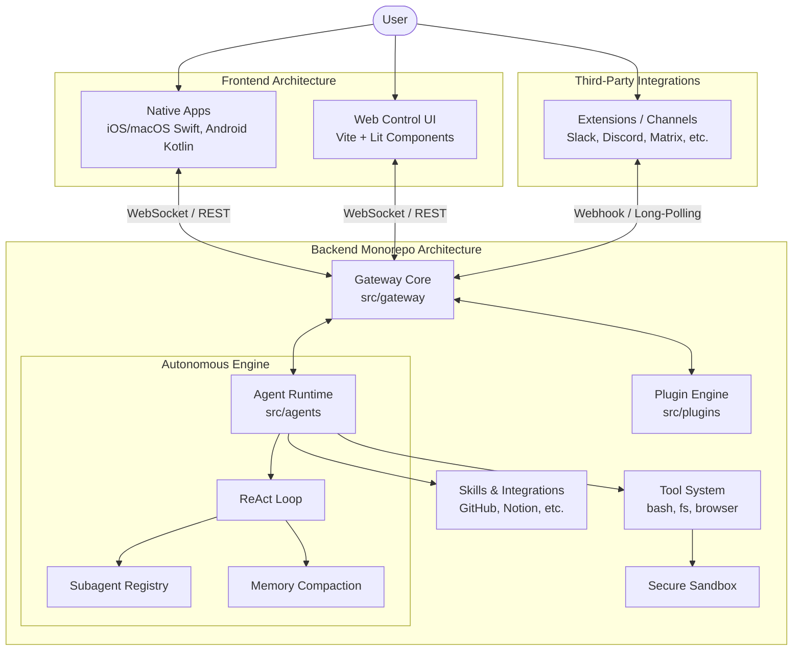

# AutoCrab (Original OpenClaw) Architecture Design & Analysis

## 1. Executive Summary

This document provides a comprehensive architectural analysis of the original Node.js-based AutoCrab (formerly OpenClaw) project. AutoCrab operates as a powerful local AI assistant capable of managing and orchestrating agents to execute complex, multi-step tasks. It interacts seamlessly with sandboxed workspaces, computer systems, and various messaging channels (e.g., Slack, Discord, Telegram, Terminal).

The goal of this document is to detail the underlying implementation, highlight the severe drawbacks in its current memory management (token usage) implementation, and outline a robust, industry-standard strategy for converting the backend to Python while preserving frontend and channel compatibility.

## 2. Codebase Structure Diagram

---

## 3. System Architecture & Core Components (Backend)

The AutoCrab project is structured as a monorepo, enforcing strict separation of concerns across multiple core components:

### 2.1 The Gateway (`src/gateway`)

The Gateway serves as the nervous system of AutoCrab.

- **Role**: It acts as the central orchestrator and entry point for all incoming and outgoing messages.
- **Responsibilities**:
  - Handles routing and payload normalization from different clients.
  - Manages authentication and channel capability resolution.
  - Maintains persistent WebSocket / REST connections with client applications (`apps/`) and channel extensions.
  - Controls the lifecycle of the Agent Server and handles configuration reloading.

### 2.2 Agent Runtime (`src/agents`)

The brain of the assistant, built to execute complex autonomous tasks.

- **ReAct Loop Execution**: Employs a continuous loop of Reasoning and Acting (ReAct). It queries Language Models (LLMs), parses the intent, and dictates which actions to take.
- **Subagent Orchestration**: Capable of spawning isolated subagents (`subagent-registry.ts`) to handle deeply nested or long-running tasks asynchronously, allowing the main agent to remain responsive.
- **Sandboxing**: Runs tasks within securely partitioned workspaces and execution contexts (`sandbox.ts`), ensuring AI actions do not compromise the host system.

### 2.3 Tool System (`src/agents/tools`)

The hands of the assistant. Tools are discrete capabilities exposed to the LLM.

- Examples include `bash` for executing interactive shell commands, `browser` for headless web navigation, and `fs` for filesystem manipulation.
- Tools are strictly strongly-typed using JSON schemas and execute under predefined security policies to prevent unauthorized lateral movement.

---

## 3. Frontend Clients & Supporting Ecosystem

While the Node.js backend handles the core logic, AutoCrab features a rich, decoupled peripheral ecosystem that connects the user to the agent. Because the system is built around a unified API Gateway with WebSocket/REST protocols, the frontends remain entirely headless and stateless—meaning they can easily survive a transition to a Python backend.

### 3.1 App Clients (`apps/`)

AutoCrab provides native desktop and mobile applications that connect to the Gateway:

- **macOS & iOS**: Built with native **Swift** (`Package.swift`, `project.yml`). These provide deep OS integration (e.g., Share Extensions, SwiftUI widgets).
- **Android**: Built with native **Kotlin/Gradle** (`build.gradle.kts`).

### 3.2 Web Control UI (`ui/`)

The `autocrab-control-ui` is a browser-based dashboard used to configure, monitor, and chat with the agent system.

- **Stack**: Built as a modern Single Page Application (SPA) using **Vite**, **Lit** (Web Components), and Reactive JS Signals (`@lit-labs/signals`).
- **Coordination**: It communicates exclusively via the Gateway's RPC and WebSocket layers, fetching agent states, session histories, and rendering Markdown streams (via `marked` and `DOMPurify`).

### 3.3 Channel Extensions (`extensions/`)

Extensions define the "ears and mouth" of the agent. They are independent modules operating as plugins (`src/plugins/PluginRuntime`).

- **Supported Channels**: Slack, Discord, Telegram, Matrix, WhatsApp, Feishu, SMS (via bluebubbles/imessage).
- **Operation**: They listen on their respective webhooks or Long-Polling APIs, translate proprietary message formats into standard AutoCrab payloads, and push them to the Gateway.

### 3.4 Agent Skills (`skills/`)

Skills are high-level integrations granting the agent specialized domain knowledge over widely used third-party services.

- **Examples**: Apple Notes, Notion, GitHub Issues, Trello, Spotify Player.
- **Coordination**: Unlike raw tools (like `bash`), skills are packaged combinations of tools and pre-prompt injections that tell the agent exactly how to interact with an external API or CLI.

### 3.5 Operational Scripts & Assets (`scripts/`, `assets/`, `docs/`)

- **Scripts**: Extensive Bash and TypeScript tooling used strictly for CI/CD, creating `.dmg` releases, Docker/Podman test harnesses, protocol generation (e.g., generating Swift schemas from TS interfaces), and codebase auditing.
- **Docs**: Mintlify-based documentation containing architectural logic, system diagrams, and integration instructions.

---

## 4. Instruction Execution and Computer Control Flow

AutoCrab facilitates computer control and automated work through a highly structured pipeline:

1. **Input Reception**: A user sends a request via a messaging channel (e.g., UI, Swift App, Discord). The Channel Extension normalizes this request and forwards it through the Gateway to the Agent Runtime.
2. **Context & Prompt Assembly**: The Agent Runtime dynamically builds a context window. It injects the system prompt, available tool schemas, workspace constraints, and the user's historical session data.
3. **The ReAct Execution Loop**:
   - **Think (LLM Generation)**: The LLM analyzes the context and determines if an action is required.
   - **Act (Tool Use)**: If the LLM generates a `tool_use` request (e.g., "Run this bash script to list files"), the execution is hijacked by the Agent Server. The server routes the payload to the specific tool handler (e.g., `bash-tools.exec.ts`).
   - **Observe (Tool Result)**: The tool performs the operation on the host or inside a sandbox. The output (stdout/stderr or browser DOM data) is wrapped in a `tool_result` tag and fed back into the LLM context.
4. **Resolution**: The loop continues until the LLM determines the task is complete, at which point it formulates a final natural-language response which the Gateway streams back to the user interface.

---

## 5. State & Memory Management Analysis (The Token Bottleneck)

A critical flaw in the original Node.js implementation lies in its handling of context window limits and memory retention. As sessions grow, retaining infinite context is impossible, so the system relies on **Auto-Compaction** (`src/agents/compaction.ts`).

### How Compaction Works

When a session approaches the maximum token threshold, AutoCrab splits the chat history into chronological chunks and uses the LLM to generate progressive summaries (`generateSummary()`), replacing raw messages with truncated "memories".

### Critical Downsides & Excessive Token Usage

1. **Compaction Overhead**: The summarization process itself is immensely token-heavy. The prompt required to instruct the LLM to merge summaries consumes up to 4,096 reserved tokens, severely eating into the productive context window.
2. **Catastrophic Information Loss on Large Tool Outputs**: The system fundamentally fails when an agent reads a massive file or receives huge terminal output.
   - _The Flaw_: The `isOversizedForSummary` logic detects if a single message exceeds 50% of the context window. If it does, the compaction engine completely abandons summarizing it and drops the message entirely, replacing it with `[Large message (~xK tokens) omitted from summary]`. The AI instantly loses critical context.
3. **ReAct Loop Bloat**: Long-running subagents inevitably generate massive, redundant traces of `tool_use` and `tool_result` pairs. Because standard LLMs have rigid context limits, these loops quickly trigger compaction, wiping out the exact granular details the agent needs to complete a complex task.

---

## 6. Python Conversion Strategy (Backend Architecture)

To convert the Node.js backend to Python while preserving total frontend/channel compatibility and fixing the memory issues, the following architecture should be adopted:

### 6.1 Gateway & Transport Layer

- **Framework**: Use **FastAPI** coupled with `uvicorn` or `gunicorn`. FastAPI natively supports WebSockets and high-concurrency async operations.
- **RPC & Protocol Parity**: Create a strict Pydantic-based schema repository to exactly match the JSON payloads currently expected by the native Swift/Kotlin applications, the Lit Web UI, and the Extensions. As long as the FastAPI endpoints echo the existing Node.js WebSocket/HTTP signatures, the frontends require zero alteration.

### 6.2 Agent Engine & ReAct Loop

- **Frameworks**: Leverage **LangGraph** or **LlamaIndex** to construct the Agent Engine. Python's AI ecosystem provides vastly superior, out-of-the-box abstractions for building stateful, looped AI workflows natively.
- **Tool Sandbox**: Port the bash and filesystem tools using Python's `subprocess` and `docker` SDKs. Ensure strict `chroot` or Docker-based sandboxing is maintained for security.

### 6.3 Complete Overhaul of Memory Management (RAG)

Instead of relying on the flawed LLM summarization (Compaction) mechanism, the Python backend must adopt a **Retrieval-Augmented Generation (RAG) + Semantic Memory** approach.

1. **Vector Database Integration (ChromaDB or FAISS)**:
   - Store historical chat interactions and `tool_result` outputs as embedded vectors rather than raw text arrays.
   - When the agent acts, dynamically query the vector DB for the most contextually relevant past steps, rather than forcing the entire history into the context window.
2. **Semantic Tool Truncation & Chunking**:
   - If a tool reads a giant file, do not dump the string into the context window. Instead, pipe the output through LangChain's text splitters, embed the chunks into the vector database, and return a "Document loaded into memory. You may query it." response to the agent.
3. **Hierarchical Summarization**:
   - Use background Celery/RQ workers to asynchronously summarize older tasks using small, cheap models (e.g., Llama 3 8B), reserving the main context window of the costly frontier model exclusively for the immediate ReAct loop.

### 6.4 Extension & Plugin Ecosystem Porting

- **Channels**: Channel extensions like Discord and Slack can be ported as asynchronous FastAPI background tasks or dedicated router modules (`APIRouter`), adhering strictly to the same webhook event signatures.
- **Skills**: Python naturally excels at API integrations. Apple Notes, Notion, and GitHub skills can be rebuilt using standard Python request wrappers or official SDKs (e.g., `PyGithub`).

---

## 7. Developer Guidelines & Technical Context for Porting

To ensure developers have the full technical context required to execute the Python migration, the following internal sub-systems present in the Node.js implementation must be replicated or replaced:

### 7.1 Configuration Management (`src/config/`)

AutoCrab relies on a rigid configuration hierarchy (Defaults -> Environment Variables -> `config.json` -> Runtime Overrides).

- **Zod Schemas**: The system heavily relies on `zod` (`zod-schema.ts`) to validate all incoming configurations and environment variables at boot.
- **Python Equivalent**: Use **Pydantic** (`BaseSettings`). Pydantic offers identical nested validation, type coercion, and environment variable overriding out-of-the-box, making it a 1:1 replacement for Zod.

### 7.2 System Administration & CLI (`src/cli/`)

AutoCrab has an extensive command-line interface managing internal lifecycles.

- **Features**: Includes commands for starting gateways (`gateway-cli`), background daemons (`daemon-cli`), cron jobs (`cron-cli`), and plugin management (`plugins-cli`).
- **Python Equivalent**: Use **Typer** or **Click** to build the CLI application. Background daemon management can be handled via `systemd` configurations or Python daemon orchestration libraries.

### 7.3 Plugin & Extension Loading (`src/plugins/`)

Extensions and skills are dynamically loaded at runtime.

- **Mechanics**: Node.js currently uses dynamic `import()` via a specialized loader (`loader.ts`) matching manifest files (`manifest.ts`).
- **Python Equivalent**: Use Python's built-in `importlib` and `pkg_resources` (or `importlib.metadata`) entry points. This allows external Python packages (plugins) to register themselves automatically without hardcoded imports.

### 7.4 Data Persistence & Session Storage (`src/gateway/session-utils.fs.ts`)

The Node.js backend currently stores agent chat history, thread locks, and state directly on the filesystem as JSON transcripts.

- **The Issue**: FS-based state heavily limits horizontal scalability and concurrency.
- **Python Equivalent**: As outlined in the Memory Management section, porting this to a proper relational database (**PostgreSQL / SQLite via SQLAlchemy**) for session metadata, paired with a Vector DB for the exact transcripts, is mandatory for enterprise readiness. Raw FS writing should be deprecated.

### 7.5 Internal Packages (`packages/`)

The workspace includes shared packages like `clawdbot` and `moltbot` which function as internal utility sub-agents or standalone bot instances.

- **Python Equivalent**: Convert these into standard Python submodules or independent Poetry/Pip-managed packages mapped under a `src/packages/` namespace.
